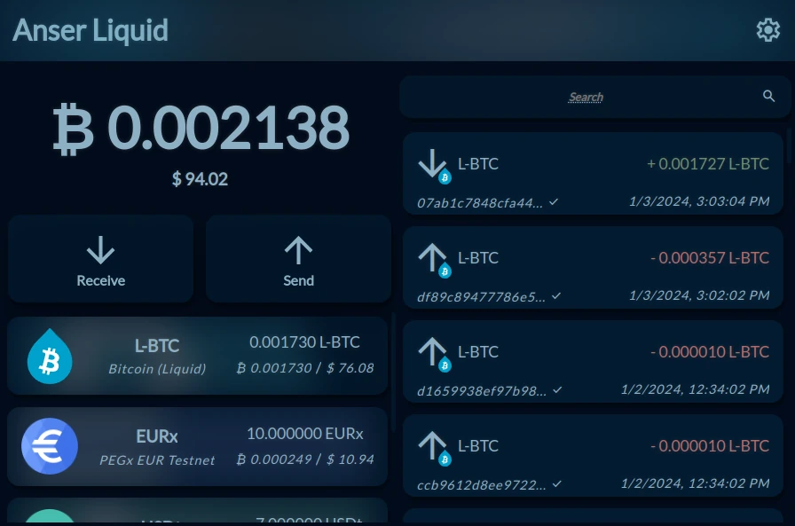

# Anser: A liquid companion for Alby

[](https://anserliquid.frk.wf)

Anser is a client-side web app that uses the [Alby extension](https://getalby.com/)'s
liquid integration to provide a simple interface to the Liquid Network.

See the [FAQ](#faq) for more details.

# Usage

Anser is a progressive web app that can be easily installed on your device, providing a native app experience. Alternatively, you can utilize it directly within your browser or even host your own instance.

## Stable

There is a live version hosted on github pages that is automatically updated with every release, you can find it [here](https://anserliquid.frk.wf) also available on IPfs (check the [Release Page](https://github.com/riccardobl/anser-liquid/releases) for the link).

## Dev Snapshot

If you wish to test the latest updates from the master branch, you can access the snapshot [here](https://anser-snapshot.surge.sh).

# Self Hosting

## Self-hosting as static files (easiest when starting from scratch)

Anser is a web app that can be hosted on any web server capable of serving static files.

1. Download the latest release from the [Release Page](https://github.com/riccardobl/anser-liquid/releases).
2. Unzip the archive
3. Upload the extracted files to your web server

## Self-hosting as a docker container (best)

Anser is also available as a self-contained docker container that can be run on any docker host. You can build a docker image from this repo (see [Build and run with Docker](#build-and-run-with-docker)) or you can pull the latest image from github package registry.

```bash
# Pull the image ( check https://github.com/riccardobl/anser-liquid/pkgs/container/anser-liquid for the latest version )
docker pull ghcr.io/riccardobl/anser-liquid:v1.0

# Run and expose on port 8080
docker run -d \
--restart=always \
--name="anserliquid" \
--read-only \
--tmpfs /data \
--tmpfs /tmp \
--tmpfs /config \
-p 8080:80 \
ghcr.io/riccardobl/anser-liquid:v1.0

```

# Development

## Using Anser Library in your website

One way to use Anser Library is to include the [LiquidWallet.js](src/js/LiquidWallet.js) script as a module and instantiate a LiquidWallet object.

However to make things even easier, there is an additional set of simplified APIs that is automatically exported in window.liquid namespace when the script is included as a normal script tag.

```html
<script src="https://cdn.jsdelivr.net/gh/riccardobl/anser-liquid@releases/{VERSION}/liquidwallet.lib.js"></script>
```

N.B. Replace {VERSION} with the latest version from the [Release Page](https://github.com/riccardobl/anser-liquid/releases).

The `window.liquid` API provides common functionalities in a more intuitive way.
See the documentation [here](/API.md).

You can find the minified version of LiquidWallet.js that can be used both as a module and as a script tag in the [Release Page](https://github.com/riccardobl/anser-liquid/releases) or in [JsDelivr](https://www.jsdelivr.com/package/gh/riccardobl/anser-liquid).

## Build and run locally

### Test, build and run locally

#### Requirements

-   [NodeJS and NPM](https://docs.npmjs.com/downloading-and-installing-node-js-and-npm)
-   git
-   bash

#### Setup

```bash
# Clone the repo
git clone https://github.com/riccardobl/anser-liquid.git

# Enter the directory
cd anser-liquid

# (Optional) checkout a specific version
# git checkout v1.0

# Prepare the environment
bash prepare.sh

# Test (this will run a local server on port 9000)
npm run start

# Build (this will build a release version in the dist/ directory)
BUILD_MODE="production" npm run build
```

### Build and run with Docker

#### Requirements

-   [Docker](https://docs.docker.com/get-docker/)

#### Setup

```bash
# Clone the repo
git clone https://github.com/riccardobl/anser-liquid.git

# Enter the directory
cd anser-liquid

# (Optional) checkout a specific version
# git checkout v1.0

# Build
docker build -t anserliquid .

# Run and expose on port 8080
docker run -it --rm \
--name="anserliquid" \
--read-only \
--tmpfs /data \
--tmpfs /tmp \
--tmpfs /config \
-p 8080:80 \
anserliquid

```

#### TSL certificate

The anser container does not provide a TSL certificate.
To enable https you can use a reverse proxy like [nginx](https://www.nginx.com/) or customize the Caddyfile and rebuild the container.

## Source code structure

The source code is logically divided in 2 parts:

-   [src/js/LiquidWallet.js](src/js/LiquidWallet.js) serves as the backend component, managing all interactions with various APIs. It provides a streamlined interface that can be easily integrated with any application.
-   [src/js/ui](src/js/ui) contains everything related to the UI of the web app.

The entry point of the web app is

-   [src/js/index.js](src/js/index.js)

# FAQ

### Q: Do I need Alby to use Anser?

Yes, Anser relies on the Alby browser extension for key management and signing.

### Q: Can you see my private keys, transactions, or balances?

No, Anser is a fully client-side app; your keys never leave the Alby extension.

### Q: Does Anser hold or transmit my funds?

No, Anser serves as an interface that filters and displays data from the Liquid Network. It enables you to create valid transactions that are signed by the Alby extension and broadcasted through an Electrum node.

### Q: Who manages the Electrum node used by Anser?

Anser connects to the public websocket endpoint provided by [Blockstream](https://github.com/Blockstream/esplora/blob/master/API.md).
It's important to note that this node only provides access to public data of the Liquid Network, and broadcast your transactions to the other nodes. It does not hold your keys or funds and cannot sign or build transactions on your behalf.

### Q: Can I self-host Anser?

Absolutely! Anser is a static web app that can be hosted on any webserver, including your local machine.
